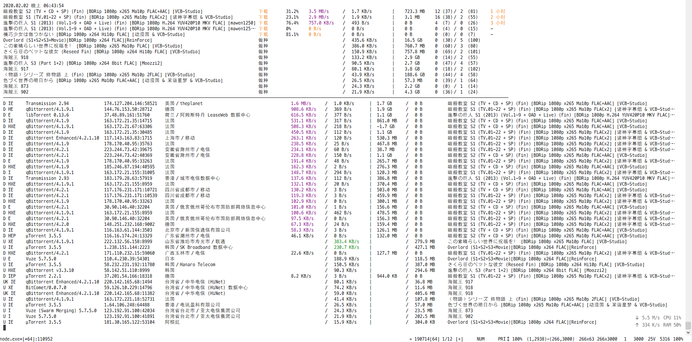
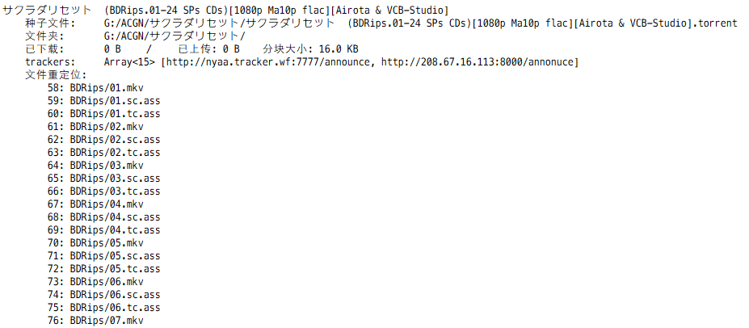

# uTorrent 自动屏蔽迅雷脚本
## 功能
每隔 30 秒，自动检查 uTorrent 已连接的用户列表，找出迅雷客户端，强制断开，不给吸血雷上传任何数据，并将用户 IP 加入黑名单阻止其再次连接，把带宽留给正规 BT 客户端。

## 2020.07.04 Update
- coffeescript → typescript

- `UTorrent.ts` 支持 IP 定位，可根据地理位置屏蔽 peers

- `ResumeData.ts`:  批量可编程式修改 uTorrent 的 resume.dat 内保存的任务信息，从而:
    - 1. 可以批量修改本地文件的路径和文件名，并建立到原有种子文件内文件信息的映射，保持继续做种的能力
    - 2. 批量重命名任务，恢复上传量、下载量
    - 3. 提供 API 修改 resume.dat 内保存的任何信息

- 增加命令行监控，实时查看 peers 情况  

- 更新了屏蔽策略，下载时对有上传流量的 peers 放宽处理，新的屏蔽策略如下
    ```ts
    this.should_block = this.torrent.state[0] === '做种' ?
        /-XL0012-|Xunlei|^7\.|aria2|Xfplay|dandanplay|FDM|go\.torrent|Mozilla/i.test(this.client) && this.upload_speed > 10 * 2 ** 10
    : this.torrent.state[0] === '下载' ?
        /-XL0012-|Xunlei|^7\.|aria2|Xfplay|dandanplay|FDM|go\.torrent|Mozilla/i.test(this.client) && this.uploaded > this.downloaded * 10 + 5 * 2**20
    :
        false
    ```
    
- 暂未打包和 realease ，请直接使用代码，有空再 release

## 预览
### 命令行监控


### resume.dat 解析及文件重定向


## 屏蔽列表
#### 完全屏蔽
-XL0012-***  
Xunlei/***  
7.x.x.x
#### 反吸血屏蔽(下载量超过上传量的两倍时屏蔽)
Xfplay  
FDM  
dandanplay  
Mozilla  
go.torrent


## 实现方法
1.  根据 uTorrent 的 WebUI API 发送 http request 获取所有已连接用户 (peers) 信息
2.  按照 client name 筛选出使用迅雷的 peer IP，写入 ipfilter.dat 文件
3.  发送 http request 让 uTorrent 重新加载 ipfilter.dat
4.  uTorrent 禁止 ipfilter.dat 中的 IP 连接

## 使用方法
1. 确保 uTorrent 已开启 WebUI (网页界面)
2. 在 uTorrent 安装目录下保证 ipfilter.dat 文件存在（若不存在则新建空白 ipfilter.dat 文件），脚本会在原有 ipfilter.dat 文件内容之后添加被屏蔽的迅雷 IP，不影响已有内容及其功能。 
3. 在高级选项中设置 bt.use_rangeblock: false
4. 参考 `UTorrent.ts` 中的 `repl_utorrent`


#### uTorrent Log
勾选 记录用户通讯信息 > 记录用户拦截连接
```
[2018-11-22 19:03:43]  Loaded ipfilter.dat (51 entries)
[2018-11-22 19:03:46]  IpFilter blocked peer 223.81.192.235
[2018-11-22 19:03:49]  IpFilter blocked peer 223.81.192.235
[2018-11-22 19:04:06]  IpFilter blocked peer 223.81.192.235
[2018-11-22 19:04:21]  IpFilter blocked peer 183.25.54.216
[2018-11-22 19:04:46]  IpFilter blocked peer 223.81.192.235
...
```

## 相关项目
Python 脚本实现: [https://github.com/yefengo/utorrent-block-xunlei](https://github.com/yefengo/utorrent-block-xunlei)


## ------------ 以下部分 deprecated ------------
## 脚本
```coffeescript
fs      = require 'fs'

cheerio = require 'cheerio'
request = require 'request-promise-native'
Sugar   = require('sugar').extend()


log = console.log.bind console

# 自行修改脚本中 root_url, auth, ipfilter_path 相关内容
# 检查间隔时间可在脚本中自定义，IP黑名单(ipfilter.dat) 建议每天清空一次。

utorrent=
    root_url: 'http://127.0.0.1:1000/gui/'
    auth:
        user: 'xxx'
        pass: 'xxxxxx'
    ipfilter_path: 'C:/Users/xxx/AppData/Roaming/uTorrent/ipfilter.dat'
    
    blocked_ips: []
    logging: true
    
    init: ->
        @cookies= request.jar()
        token_html = await request
            uri: @root_url + 'token.html'
            auth: @auth
            jar: @cookies
        $ = cheerio.load token_html
        @token = $('div').text()
        @blocked_ips = fs.readFileSync(@ipfilter_path, 'UTF-8').split('\n').unique()
        await @get_torrents()
        
    call: ({api='', params, method='GET'}={})->
        JSON.parse await request
            uri: @root_url + api
            method: method
            qs:{
                token: @token
                params...
            }
            auth: @auth
            jar: @cookies
    
    get_torrents: -> 
        result = await @call params: list: 1
        @torrents = result.torrents
        @hashes = @torrents.map (x)-> x[0]
    
    get_peers: (hash)->
        resp = await @call params:
            action: 'getpeers'
            hash: hash
        for peer in resp.peers[1]
            ip             : peer[1]
            hostname       : peer[2]
            country        : peer[0]
            port           : peer[4]
            client         : peer[5]
            flags          : peer[6]
            downloaded     : peer[13]
            uploaded       : peer[14]
            uploading_speed: peer[16]
    
    get_all_peers: ->
        peers = []
        for hash in @hashes
            peers.append await @get_peers hash
        peers.unique('ip').sortBy 'client'
        
    block: ->
        await @get_torrents()
        peers = await @get_all_peers()
        peers2block = peers.filter (peer)->
            peer.client.match(/(-XL0012-)|(Xunlei)|(^7\.)|(QQDownload)/i) ||
            peer.downloaded > 2 * peer.uploaded &&
            peer.client.match ///
                (Xfplay)|
                (dandanplay)|
                (FDM)|
                (go\.torrent)|
                (Mozilla\/)
                ///i
            
        if peers2block.isEmpty() then return
        if @logging then log '屏蔽', peers2block.map ['ip', 'client']
        
        @blocked_ips = @blocked_ips.append(peers2block.map('ip')).unique()
        fs.writeFileSync(@ipfilter_path, @blocked_ips.join('\n') + '\n')
        
        await @call params:
            action: 'setsetting'
            s: 'ipfilter.enable'
            v: '1'
        # log '已重载 ipfilter.dat'
        
    set_ip: (ip)->
        await @call params:
            action: 'setsetting'
            s: 'tracker_ip'
            v: ip
    
    unblock: ->
        @blocked_ips = []
        await @call params:
            action: 'setsetting'
            s: 'ipfilter.enable'
            v: '0'
    
    reset_blocking: (immediate=false)->
        @blocked_ips = []
        if !immediate then return
        fs.writeFileSync(@ipfilter_path, @blocked_ips.join('\n') + '\n')
        await @call params:
            action: 'setsetting'
            s: 'ipfilter.enable'
            v: '1'
        
    run: ->
        await @block()
        @task = setInterval => 
            await @block()
        , 30*1000
        
    stop: ->
        clearInterval @task

main= ->
    await utorrent.init()
    await utorrent.run()

main()
```


## 日志
未检测到迅雷时
```
当前已连接用户
[ { ip: '180.94.154.163', client: 'µTorrent/3.5.4.0' },
  { ip: '223.140.248.38', client: 'BitComet 1.53' },
  { ip: '101.88.108.19', client: 'µTorrent/2.2.1.0' },
  { ip: '39.161.242.50', client: 'Unknown FD/5.1.0.0' },
  { ip: '171.88.70.72', client: 'Transmission 2.94' },
  { ip: '218.79.69.196', client: '[FAKE] µTorrent/3.0.0.0' },
  { ip: '123.204.251.13', client: 'BitComet 1.51' },
  { ip: '154.103.221.22', client: 'qBittorrent 4.1.3' },
  { ip: '118.150.188.121', client: 'μTorrent 3.5.3' }]
```

检测到迅雷时
```
使用迅雷的用户
[ { ip: '183.25.54.216', client: '-XL0012-溶S鑋亾#+4厓' },
{ ip: '223.81.192.235', client: '-XL0012-輓%??1涙鷉' },
{ ip: '223.72.70.198', client: '7.10.35.366' }]
reading C:/Users/shf/AppData/Roaming/uTorrent/ipfilter.dat
wrote C:/Users/shf/AppData/Roaming/uTorrent/ipfilter.dat
ipfilter.dat updated
ipfilter.dat reloaded
```


## 使用方法
1. 确保 uTorrent 已开启 WebUI (网页界面)
2. 在 uTorrent 安装目录下保证 ipfilter.dat 文件存在（若不存在则新建空白 ipfilter.dat 文件），脚本会在原有 ipfilter.dat 文件内容之后添加被屏蔽的迅雷 IP，不影响已有内容及其功能。 
3. 在高级选项中设置 bt.use_rangeblock: false
4. [下载压缩包并解压](https://github.com/ShenHongFei/utorrent-block-xunlei/releases/download/v1.0/uTorrentBlockXunlei.zip)  
5. 打开解压后的文件夹中的 utorrent.js 文件，根据 WebUI 的配置修改 root_url, auth, ipfilter_path(ipfilter.dat 文件路径)
6. 双击 运行.cmd

